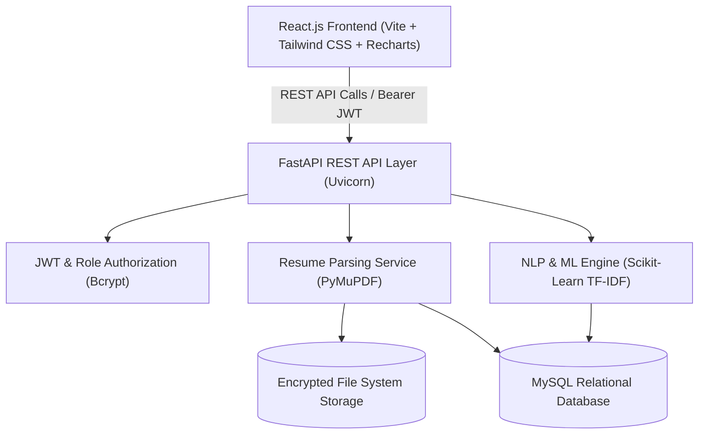
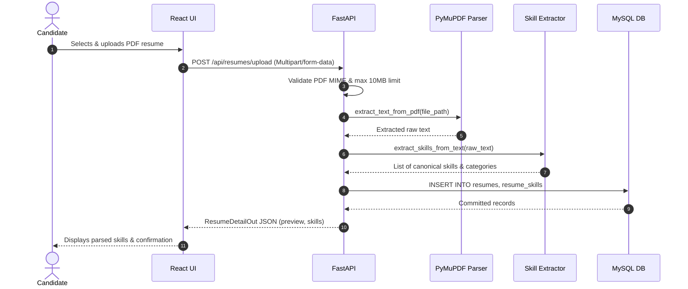
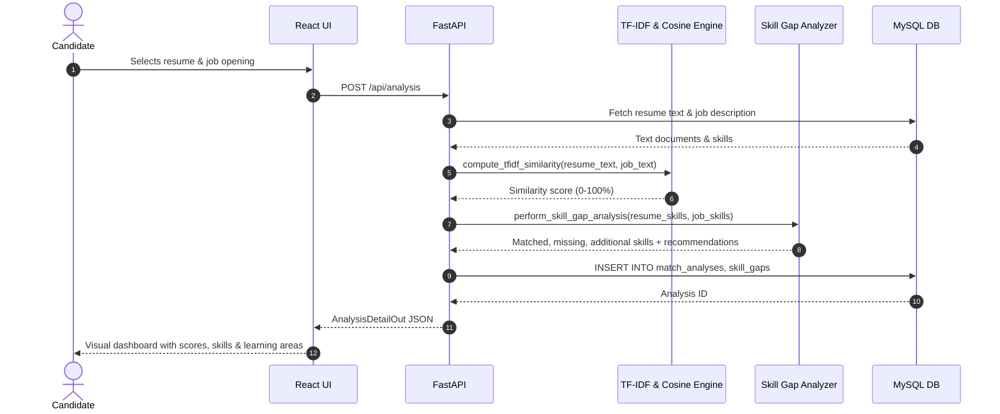
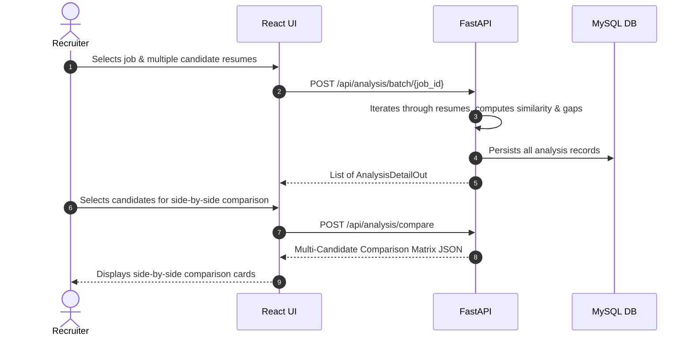

# System Architecture Documentation

## 1. High-Level Architecture Overview

The **AI Resume Intelligence & Job Matching Platform** is structured as a decoupled, multi-tier full-stack application following clean architectural separation of concerns:

---

## 2. Component Layers & Responsibilities

### 2.1 Presentation Tier (Frontend)
- **Framework**: React 19 + Vite 6
- **Routing**: React Router DOM (v7)
- **State & Auth**: `AuthContext` with JWT persistence and Axios interceptors
- **Styling**: Tailwind CSS (v4) with SaaS-grade cards, skill tags, and responsive grids
- **Data Visualization**: Recharts (BarCharts, PieCharts, Progress Gauges)
- **Role Modes**:
  - `CANDIDATE`: Profile dashboard, resume upload, live job comparison, skill gap feedback, history.
  - `RECRUITER`: Recruiter dashboard, job creation, batch resume analysis, multi-candidate comparison matrix.

### 2.2 Application & Service Tier (Backend)
- **Framework**: FastAPI (Python 3.14 compatible, asynchronous async/await support)
- **Web Server**: Uvicorn ASGI
- **Security**: PyJWT token issuance and validation, direct bcrypt password hashing with unique salt rounds
- **Services Layer**:
  - `resume_parser.py`: PyMuPDF stream reader, handles empty/corrupt documents.
  - `resume_service.py`: Validates MIME types, extensions, size constraints, extracts text, extracts skills, commits to DB.
  - `job_service.py`: Recruiter job CRUD, skill requirement definitions.
  - `analysis_service.py`: Computes TF-IDF similarity, executes skill gap logic, commits analysis records.
  - `text_preprocessing.py`: Preserves technical tokens (`C++`, `.NET`, `Node.js`) while removing general stopwords.
  - `skill_gap.py`: Set theory evaluation for missing/matched/additional skills with learning recommendations.

### 2.3 Persistence Tier (MySQL Database)
- **Database Engine**: MySQL 8.0 (InnoDB, UTF-8 MB4)
- **ORM**: SQLAlchemy 2.0 with connection pooling and pool pre-ping
- **Driver**: PyMySQL
- **Schema Entities**:
  1. `users`: Stores candidate and recruiter credentials and role flags.
  2. `resumes`: Metadata, file paths, extracted raw text, and cleaned text.
  3. `resume_skills`: Normalized detected skills per resume (unique constraint prevents duplication).
  4. `jobs`: Position descriptions, company, experience level.
  5. `job_required_skills` & `job_preferred_skills`: Required skill criteria.
  6. `match_analyses`: Recorded TF-IDF similarity scores and skill matching percentages.
  7. `skill_gaps`: Detailed records of matched, missing, and extra skills per analysis.
  8. `learning_recommendations`: Master catalog of curated learning topics and links.

---

## 3. Core Workflows

### 3.1 Resume Upload Workflow

### 3.2 Candidate Job Match & Gap Analysis Workflow

### 3.3 Recruiter Batch Evaluation & Comparison

---

## 4. Privacy & Authorization Model
- Resumes are stored on disk with non-deterministic UUID prefixes.
- Candidates have strict role-based access control preventing them from inspecting resumes belonging to other users (`HTTP 403 Forbidden`).
- Direct file download endpoints (`/api/resumes/{id}/file`) require active JWT authentication and ownership/recruiter validation.
